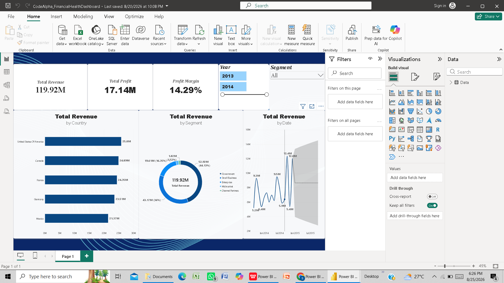

# 📊 Financial Health & Profitability Dashboard

**CodeAlpha Power BI Data Analytics Internship — Task 1**

---

## 📌 Project Overview
An interactive Power BI dashboard developed to analyze and monitor organizational financial health, operational costs, profit margins, and multi-year revenue trends for strategic decision-making.

---

## 🖼️ Dashboard Preview


---

## 🔑 Key Features & Analytical Insights
* **Executive Financial KPIs:** High-level tracking of Gross Sales, Net Revenue, COGS, and Overall Profitability Margins.
* **Profitability & Cost Analysis:** Breakdown of Cost of Goods Sold (COGS) versus Net Profit across business segments and product tiers.
* **Geographic Breakdown:** Multi-country comparative performance assessing revenue distribution across international markets.
* **Financial Forecasting:** Historical trend evaluation enabling predictive budgeting and operational cost controls.
* **Dynamic Slicers:** Multi-attribute filtering across Country, Segment, and Date hierarchies.

---

## 🧹 Data Cleaning & Preprocessing (Power Query)
* Formatted currency and numerical types across financial transaction fields (`Gross Sales`, `Discounts`, `COGS`, `Profit`).
* Handled missing discount values and verified negative profit records for accurate margin calculation.
* Extracted date dimensions (`Year`, `Month Number`, `Month Name`) to support continuous timeline trend forecasting.

---

## 🛠️ Tech Stack & Tools
* **BI Platform:** Microsoft Power BI Desktop.
* **Analytical Modeling:** DAX (Data Analysis Expressions).
* **ETL Transformation:** Power Query.
* **Source Data:** Financial Sample Dataset (`.xlsx`).

---

## 📁 Repository Structure
```text
├── CodeAlpha_FinancialHealthDashboard.pbix   # Power BI Report File
├── 04-01-Financial Sample Data.xlsx           # Source Dataset
├── task1_dashboard.png                        # Dashboard Screenshot
└── README.md                                  # Project Documentation
